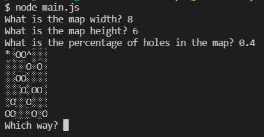

# Find Your Hat

A fun game where the player has to find its hat.

## Table of contents
- [General info](#general-info)
- [Objective](#objective)
- [Technologies](#technologies)
- [Setup](#setup)

## General info

The game consists of a player, stands for '*', in a map where exist holes, stands for 'O', and the player's hat, stands for '^'. If the player goes to a position outside of the map or where there is a hole, the player lose. Otherwise, if the player be able to go to the position where the hat is, the player wins.

## Objective

Put in practice the concepts that I've learnt about JavaScript, especially about OOP and Modules.

## Technologies

- JavaScript
- JavaScript Modules
- Node
- Github
- Git

## Setup

To run the project locally, download the project and run, with Node, the main.js file.

